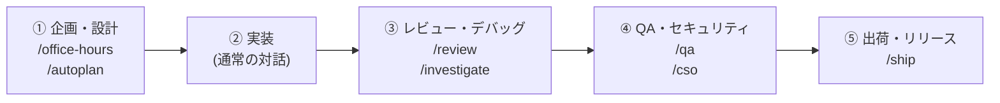

# 🚀 Antigravity で始める gstack 初心者ガイド

`gstack` は、AI Agent（Antigravity）に**「専門家の役割（CEO、設計者、QA、セキュリティ責任者など）」**と**「洗練された手順書」**を与えて、開発の質を劇的に高めるスキルフレームワークです。

---

## 💡 基本の使い方

使い方はとても簡単です。Antigravity のチャット画面で**コマンド（スラッシュコマンド）**を入力するか、**自然言語**で話しかけるだけです。

### 例：
* `/office-hours` または `アイデアを相談したい`
* `/autoplan` または `この機能の計画を自動レビューして`
* `/review` または `コードをレビューして`
* `/cso` または `セキュリティチェックを行って`
* `/ship` または `変更をテストしてリリース準備をして`

---

## 🗺️ おすすめの標準開発フロー

開発の流れに合わせて以下の順番でスキルを使うと、手戻りのない高品質な開発ができます。



---

### 1. 企画・設計フェーズ（コードを書く前）

「何を作るか」「どんな仕様にするか」を固めるフェーズです。

| スキル | 説明 | こんな時につかう |
| :--- | :--- | :--- |
| **`/office-hours`** | 6つの問いでアイデアを掘り下げる「相談室」 | 「こんな機能作ろうと思うんだけどどう思う？」と相談したい時 |
| **`/plan-ceo-review`** | 経営者・プロダクトオーナー目線で計画を拡大 | 計画をより魅力的なプロダクトに磨き上げたい時 |
| **`/plan-eng-review`** | アーキテクチャ・データ構造・例外処理のロック | 実装前に設計の穴やエッジケースを潰したい時 |
| **`/autoplan`** ✨おすすめ | CEO → デザイン → エンジニア → DX レビューを**一括自動実行** | 1つのコマンドで企画〜設計のレビューを一気に行いたい時 |

---

### 2. 実装・デバッグフェーズ（コードを書く時）

実際にコードを作成・修正するフェーズです。

| スキル | 説明 | こんな時につかう |
| :--- | :--- | :--- |
| **`/investigate`** | 根本原因を特定する調査（原因不明の修正禁止ルール） | エラーやバグが発生して原因がわからない時 |
| **`/careful`** | 破壊的なコマンド（`rm -rf` 等）の前に警告を発出 | 本番環境や重要なコードを触る時の安全モード |
| **`/freeze`** | 編集できるディレクトリを1つに限定 | デバッグ中に無関係なファイルを誤修正させたくない時 |

---

### 3. レビュー・品質検証フェーズ（コードを書いた後）

作成したコードの品質を検証するフェーズです。

| スキル | 説明 | こんな時につかう |
| :--- | :--- | :--- |
| **`/review`** ✨おすすめ | PR作成前のコードレビュー（潜在バグや設計違反の検出） | コードが完成してコミットする前に確認したい時 |
| **`/qa`** | ブラウザを起動して実際のWEB画面をテスト＆自動修正 | WEBアプリの画面動作やフォーム入力を検証・修復したい時 |
| **`/cso`** | OWASP Top 10・STRIDEに基づくセキュリティ診断 | 脆弱性やシークレット漏洩がないかチェックしたい時 |

---

### 4. リリリース・ドキュメントフェーズ（出荷する時）

成果物を整理して本番に反映するフェーズです。

| スキル | 説明 | こんな時につかう |
| :--- | :--- | :--- |
| **`/ship`** ✨おすすめ | テスト実行 → レビュー → コミット → PR作成 | 開発が完了して GitHub にプルリクエストを出したい時 |
| **`/document-release`** | 変更点に合わせて README やドキュメントを自動更新 | ドキュメントとコードの乖離を防ぎたい時 |

---

## 🛠️ プロジェクトへの組み込み方法

### 方法 A: シンボリックリンク（Junction）で置く場合（ローカル推奨）
PowerShell で対象プロジェクトの直下（例: `bontetsuHP`）を開き、以下の 1 行を実行するだけでリンクを作成できます：

```powershell
New-Item -ItemType Junction -Path ".agents\skills" -Target "$env:USERPROFILE\dev\gstack\.gemini\skills" -Force
```
*(管理者権限なしで動作し、`gstack` 側の更新が自動的にプロジェクト側に反映されます)*

---

### 方法 B: 実体コピーで置く場合（チーム共有・Git管理推奨）
作成した `.gemini/skills/` の中身をプロジェクト直下の `.agents/skills/` にコピーしてコミットします。

```text
your-project/
├── .agents/
│   └── skills/          # シンボリックリンク または コピー配置
│       ├── gstack-office-hours/
│       ├── gstack-review/
│       ├── gstack-qa/
│       └── gstack-ship/
```

---

## 🌟 まず最初に試してみるなら

まずはチャット欄で以下のように入力してみるのがおすすめです！

```text
/office-hours
「新しいお問い合わせフォーム機能を追加したいと考えています。相談に乗ってください。」
```
